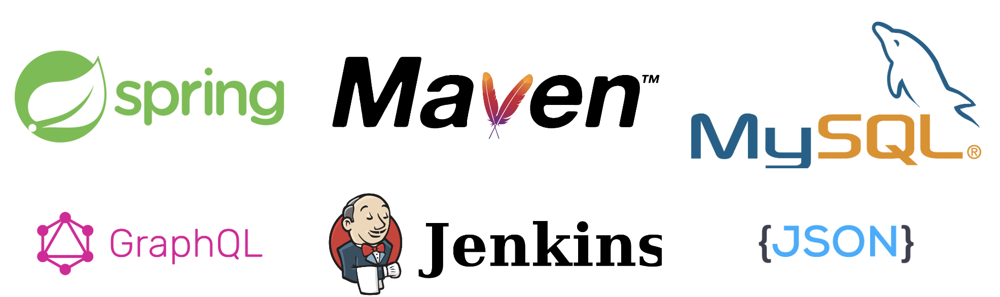

# PJI-APIRestFull

## Sommaire

1. **Résumé**
2. [Jenkins](doc/Jenkins.md)
3. [Log](doc/Log.md)
4. [Analyse Time](doc/AnalyseTime.md)
5. [Analyse Compile](doc/AnalyseCompile.md)
6. [Analyse Tests Phase](doc/AnalyseTestsPhase.md)
7. [Analyse Tests Classe](doc/AnalyseTestsClasse.md)
8. [Analyse Error](doc/AnalyseError.md)
9. [Evolution Variable](doc/EvolutionVariable.md)
10. [GraphQL Request](doc/GraphQLRequest.md)

## Résumé

L'intégration continue (CI/CD, pour Continuous Integration /Continuous Delivery) propose d'automatiser le pipeline de compilation et d'assemblage des logiciels pour assurer la reproductibilité de ce processus. Dans le cadre de ce projet, nous nous intéressons à l'étude des exécutions (builds) d'un projet qui aurait recours à un processus d'intégration continue afin d'étudier l'évolution dans le temps de ses différentes phases (e.g., compilation, test, packaging), afin de détecter de potentielles dérives (e.g., explosion du nombre de tests unitaires et du temps passé dans cette phase).

Mots Clés : continuous integration, microservice, REST, software engineering

## Projet Maven dans Jenkins

Pour avoir le temps par phase mettez `-Dorg.slf4j.simpleLogger.dateTimeFormat=HH:mm:ss,SSS -Dorg.slf4j.simpleLogger.showDateTime=true` comme option de build.

## Build jar

Pour build le jar éxcuter la commande suivante `mvn clean package`

## Dockerfile pour le deploiement

À la racine du projet vous avez un Dockerfile pour le deploiement.
/!\\ Ne pas oublié dans le fichier `application.properties de mettre le bon serveur mysql`

## Dependances

